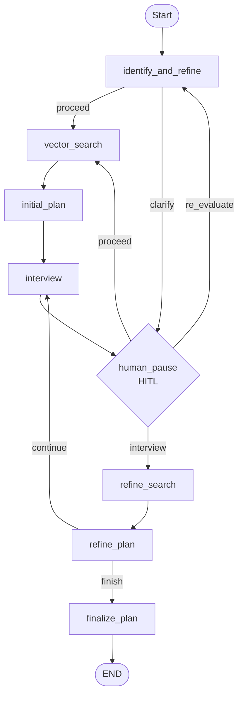
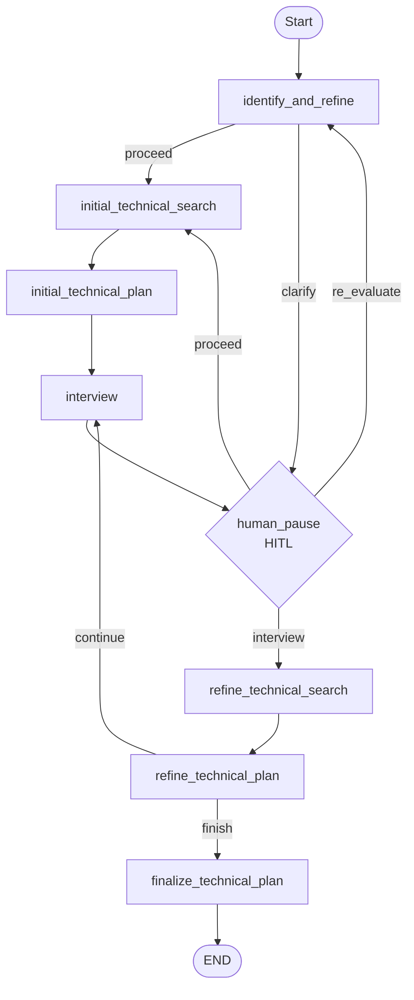
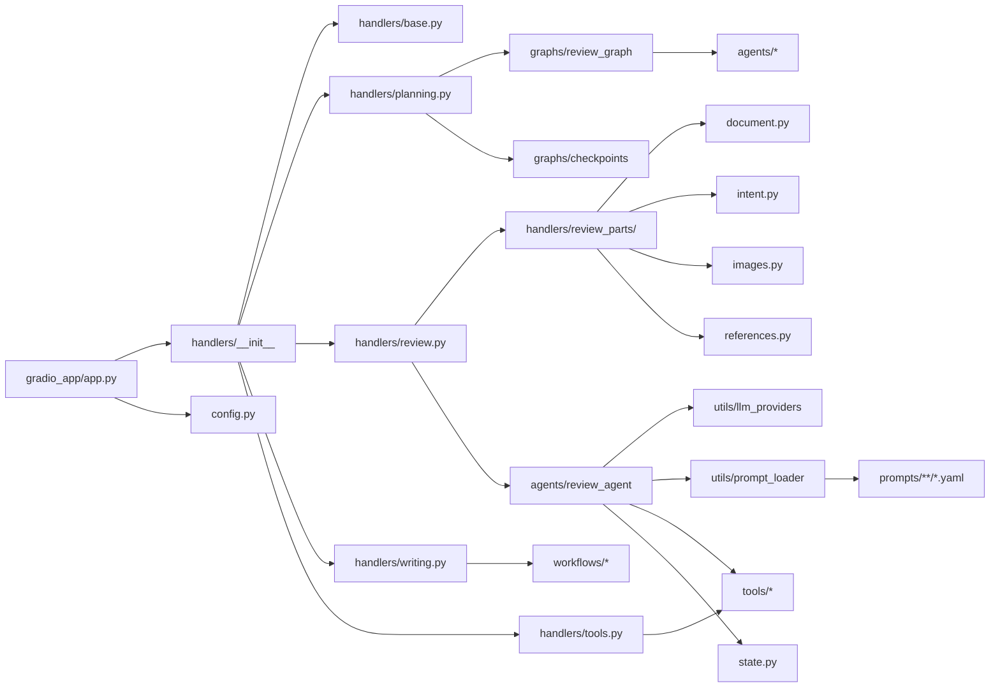

# Mermaid Diagrams

## Academic Review Graph

```mermaid
flowchart TD
    A([Start]) --> IR[identify_and_refine]
    IR -->|proceed| B[vector_search]
    IR -->|clarify| D{human_pause\nHITL}
    D -->|re_evaluate| IR
    D -->|proceed| B
    D -->|interview| F[refine_search]
    B --> C[initial_plan]
    C --> E[interview]
    E --> D
    F --> H[refine_plan]
    H -->|continue| E
    H -->|finish| G[finalize_plan]
    G --> Z([END])
```

## Technical Chapter Graph

```mermaid
flowchart TD
    A([Start]) --> IR[identify_and_refine]
    IR -->|proceed| B[initial_technical_search]
    IR -->|clarify| D{human_pause\nHITL}
    D -->|re_evaluate| IR
    D -->|proceed| B
    D -->|interview| F[refine_technical_search]
    B --> C[initial_technical_plan]
    C --> E[interview]
    E --> D
    F --> H[refine_technical_plan]
    H -->|continue| E
    H -->|finish| G[finalize_technical_plan]
    G --> Z([END])
```

## Package dependency graph

```mermaid
graph LR
    APP[gradio_app/app.py] --> H[handlers/__init__]
    H --> HB[handlers/base.py]
    H --> HP[handlers/planning.py]
    H --> HR[handlers/review.py]
    H --> HW[handlers/writing.py]
    H --> HT[handlers/tools.py]
    HR --> RP[handlers/review_parts/]
    RP --> RPD[document.py]
    RP --> RPI[intent.py]
    RP --> RPIM[images.py]
    RP --> RPR[references.py]
    HP --> GR[graphs/review_graph]
    HP --> CP[graphs/checkpoints]
    HR --> AG[agents/review_agent]
    HW --> WF[workflows/*]
    HT --> TS[tools/*]
    GR --> AG2[agents/*]
    AG --> LLM[utils/llm_providers]
    AG --> PL[utils/prompt_loader]
    AG --> TS
    PL --> PR[prompts/**/*.yaml]
    AG --> ST[state.py]
    APP --> CFG[config.py]
```
