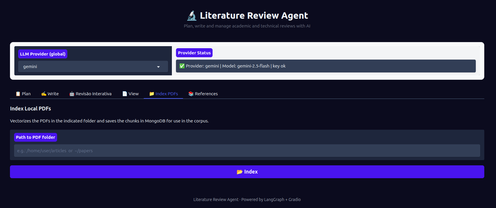

# 📁 Aba Index PDFs — Indexação de Corpus Local

## Objetivo

A aba **📁 Index PDFs** indexa uma pasta de arquivos PDF no banco de dados vetorial (MongoDB), tornando-os disponíveis para busca semântica nas abas **📋 Plan** e **✍️ Write**.

Indexe seus artigos, teses e capítulos antes de iniciar a escrita para que o agente possa encontrar e citar evidências relevantes do seu próprio corpus.

---

## Campos e controles

| Campo | Tipo | Descrição |
|-------|------|-----------|
| **Caminho da pasta** | Caixa de texto (1 linha) | Caminho absoluto ou relativo para a pasta com os PDFs (suporta `~` para home). Ex: `~/artigos` ou `/home/usuario/papers` |
| **Botão Indexar** | Botão | Inicia o processo de indexação |
| **Resultado** | Área de Markdown | Exibe o resumo da indexação com estatísticas |

---

## Fluxo passo a passo

1. Coloque seus PDFs em uma pasta local (ex: `~/artigos`).
2. No campo de texto, informe o **caminho da pasta** (suporta `~`).
3. Clique em **"📂 Index"**.
4. Aguarde o processamento — pode demorar dependendo do número e tamanho dos PDFs.
5. O resultado mostra:
   - **PDFs indexados:** novos documentos adicionados ao banco
   - **Já no banco:** PDFs que já estavam indexados (não processados novamente)
   - **Texto insuficiente:** PDFs com pouco texto extraível (imagens escaneadas sem OCR)
   - **Erros de leitura:** PDFs corrompidos ou protegidos
   - **Chunks inseridos:** total de fragmentos de texto adicionados ao vetor

---



---

## Erros comuns e como resolver

### `Pasta não encontrada`
- Verifique se o caminho está correto e se a pasta existe.
- Use o caminho absoluto para evitar ambiguidade (ex: `/home/usuario/artigos`).

### Todos os PDFs aparecem como "Texto insuficiente"
- Os PDFs podem ser digitalizados (imagens). O texto não é extraível sem OCR.
- Use uma ferramenta de OCR (ex: `ocrmypdf`, Adobe Acrobat) para gerar PDFs com texto antes de indexar.

### Erro de conexão com MongoDB
```
pymongo.errors.ServerSelectionTimeoutError
```
- Verifique se o MongoDB está rodando.
- Confirme `MONGODB_URI` e `MONGODB_DB` no `.env`.
- Para MongoDB Atlas, confirme que o IP está na lista de permissões.

### Erro de autenticação OpenAI
```
AuthenticationError
```
- A indexação usa `text-embedding-3-small` da OpenAI para gerar os vetores.
- Confirme que `OPENAI_API_KEY` está configurada no `.env`, mesmo se o provedor LLM for outro.

### PDFs já indexados são reprocessados
- O sistema identifica duplicatas pelo nome do arquivo e conteúdo.
- Se você modificou um PDF ou quer forçar a reindexação, exclua os registros correspondentes no MongoDB manualmente.

---

## Dicas de organização do corpus

- Organize os PDFs em subpastas por tema (ex: `artigos/deep_learning/`, `artigos/hidrologia/`).
- Indexe uma pasta de cada vez para facilitar o controle de erros.
- PDFs em inglês e português são suportados — o agente busca independente do idioma.
- O modelo de embeddings (`text-embedding-3-small`) processa o texto em fragmentos (chunks) de ~1000 tokens com sobreposição.
