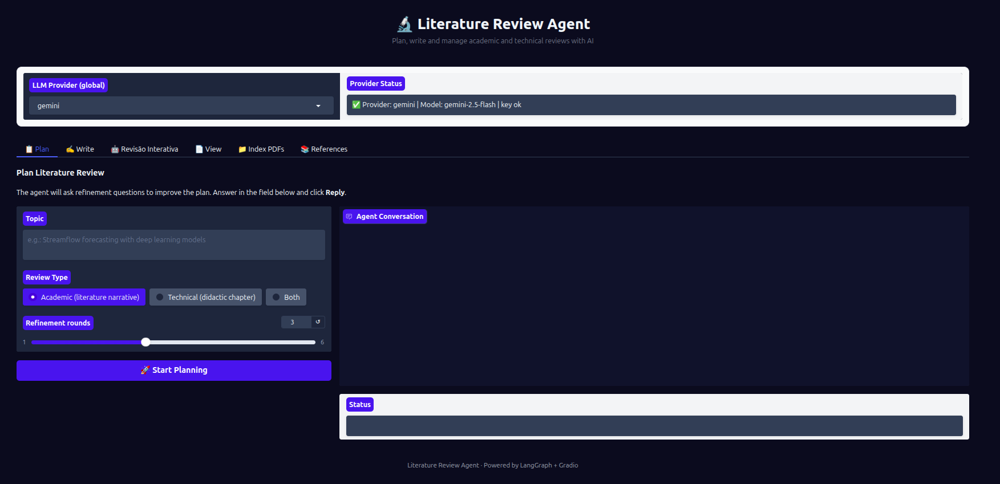
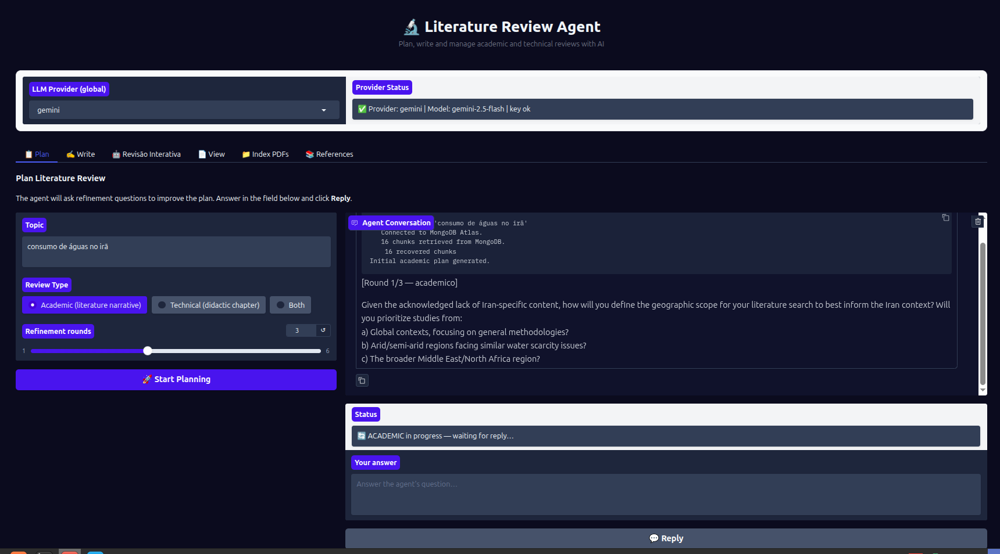

# 📋 Aba Plan — Planejamento de Revisão

## Objetivo

A aba **📋 Plan** é o ponto de partida do projeto. Ela inicia uma sessão interativa de planejamento onde o agente faz perguntas de refinamento sobre o tema informado e, ao final, gera um plano estruturado de revisão.

Dois tipos de revisão são suportados:
- **Acadêmica** — revisão narrativa de literatura (artigos, teses, periódicos)
- **Técnica** — capítulo técnico didático com base em fontes da web e corpus local

O plano gerado é salvo automaticamente na pasta `plans/` e pode ser usado como entrada na aba **✍️ Write**.

---

## Campos e controles

| Campo | Tipo | Descrição |
|-------|------|-----------|
| **Tema** | Caixa de texto | O tema ou pergunta central da revisão (ex: "Previsão de vazão com modelos de deep learning") |
| **Tipo de revisão** | Seleção (Radio) | `Academic (literature narrative)` · `Technical (didactic chapter)` · `Both` |
| **Rodadas de refinamento** | Slider (1–6) | Quantas rodadas de perguntas o agente fará antes de finalizar o plano |
| **Botão Iniciar** | Botão | Inicia a sessão de planejamento |
| **Campo de resposta** | Caixa de texto (3 linhas) | Aparece durante a sessão para o usuário responder às perguntas do agente |
| **Botão Responder** | Botão | Envia a resposta do usuário para o agente continuar |
| **Seletor de provedor LLM** | Dropdown (topo da tela) | Escolha entre google, groq, openai, openrouter |

---

## Fluxo passo a passo

1. **Selecione o provedor LLM** no dropdown no topo da tela e aguarde o status mostrar `✅`.
2. **Digite o tema** da revisão no campo "Tema". Seja específico — quanto mais detalhado, melhor o plano gerado.
3. **Escolha o tipo** de revisão: Acadêmica (corpus MongoDB) ou Técnica (web + corpus).
4. **Ajuste as rodadas** de refinamento (padrão: 3). Mais rodadas = plano mais detalhado, mas demora mais.
5. **Clique em "🚀 Start Planning"**.
6. O agente exibirá a primeira pergunta no chat. **Leia** e **responda** no campo que aparece abaixo.
7. Clique em **"💬 Reply"** para enviar sua resposta.
8. Repita até o agente indicar que o plano está finalizado.
9. O **plano renderizado** aparece abaixo do chat assim que a sessão termina.
10. O arquivo é salvo automaticamente em `plans/plano_revisao_<tema>_<data>.md`.

> **Dica:** Se não souber responder a uma pergunta do agente, escreva "Não tenho preferência" ou "Pode decidir" — o agente continuará com escolhas padrão razoáveis.

---








---

## Erros comuns e como resolver

### O botão "Start Planning" não responde
- Verifique se o provedor LLM está selecionado e com status `✅` no topo da tela.
- Verifique se o campo "Tema" não está vazio.

### Erro de autenticação do provedor LLM
```
AuthenticationError: Invalid API key
```
- Confirme que a chave do provedor selecionado está configurada no `.env`.
- Troque para outro provedor no dropdown e tente novamente.

### O chat trava e não exibe resposta
- Pode ser um timeout de rede ou limite de tokens. Tente com um tema mais curto.
- Reduza o número de rodadas de refinamento para 1 ou 2.

### O plano não é salvo em `plans/`
- A pasta `plans/` é criada automaticamente. Se não existir, rode `mkdir plans` no diretório do projeto e tente novamente.

### Sessão expirada após inatividade
- Clique em "🚀 Start Planning" novamente para reiniciar uma nova sessão.
