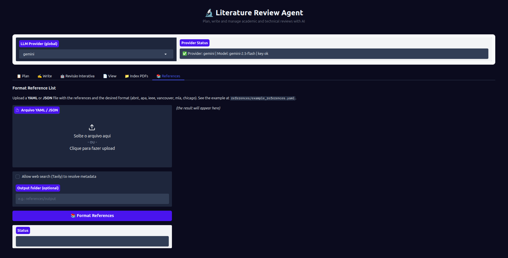

# 📚 Aba References — Formatação de Referências

## Objetivo

A aba **📚 References** formata uma lista de referências bibliográficas a partir de um arquivo YAML ou JSON, gerando a bibliografia nos padrões ABNT, APA, IEEE ou outros, em Markdown pronto para uso.

Use esta aba quando tiver uma lista de referências estruturadas e quiser formatá-las automaticamente sem escrever manualmente cada entrada.

---

## Campos e controles

| Campo | Tipo | Descrição |
|-------|------|-----------|
| **Arquivo de referências** | Upload de arquivo | Aceita `.yaml`, `.yml` ou `.json` com a lista de referências |
| **Busca web (Tavily)** | Checkbox | Permite que o agente resolva metadados faltantes buscando online (ex: completar DOI, título, autores) |
| **Pasta de saída** | Caixa de texto (opcional) | Caminho para salvar o arquivo formatado (ex: `references/output`). Se vazio, exibe apenas na tela |
| **Botão Formatar** | Botão | Inicia a formatação das referências |
| **Status** | Campo de texto (somente leitura) | Indica o resultado da operação |
| **Saída formatada** | Área de Markdown | Exibe a bibliografia formatada |

---

## Formato do arquivo de entrada

O arquivo YAML/JSON deve conter uma lista de referências com os campos disponíveis. Campos ausentes serão completados pelo agente (se a busca web estiver ativa) ou deixados em branco.

### Exemplo YAML

```yaml
- type: article
  title: "Forecasting streamflow with deep learning models"
  authors:
    - "Silva, J. A."
    - "Pereira, M. B."
  journal: "Journal of Hydrology"
  year: 2023
  volume: 45
  pages: "112-130"
  doi: "10.1016/j.jhydrol.2023.01.001"

- type: book
  title: "Inteligência Artificial: Uma Abordagem Moderna"
  authors:
    - "Russell, S."
    - "Norvig, P."
  publisher: "Elsevier"
  year: 2022
  edition: 4
```

Veja o arquivo de exemplo em [`references/example_abnt.yaml`](../../references/example_abnt.yaml).

---

## Fluxo passo a passo

1. Prepare um arquivo `.yaml`, `.yml` ou `.json` com suas referências no formato acima.
2. Clique na área de **upload** e selecione o arquivo.
3. Opcionalmente marque **"Allow web search (Tavily)"** para que o agente complete metadados faltantes.
4. Opcionalmente informe uma **pasta de saída** para salvar o resultado em arquivo.
5. Clique em **"📚 Format References"**.
6. A bibliografia formatada aparece na área de Markdown.
7. Se uma pasta de saída foi informada, o arquivo é salvo como `{pasta}/{nome_original}_formatted.md`.

---



---

## Erros comuns e como resolver

### Erro ao ler o arquivo
```
Erro ao processar o arquivo de referências
```
- Verifique se o YAML está bem formatado (indentação correta, sem tabulações).
- Teste o arquivo em um validador YAML online.

### Campos faltantes na saída
- Ative a **busca web (Tavily)** para que o agente tente completar os metadados.
- Ou adicione os campos manualmente no arquivo de entrada.

### Pasta de saída não encontrada
- O agente **não cria** a pasta de saída automaticamente.
- Crie a pasta antes de usar: `mkdir -p references/output`

### Resultado não salvo em arquivo
- Verifique se a pasta de saída foi informada corretamente no campo.
- Verifique as permissões de escrita na pasta de destino.
